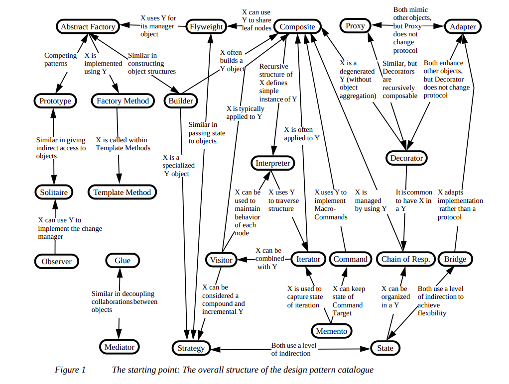
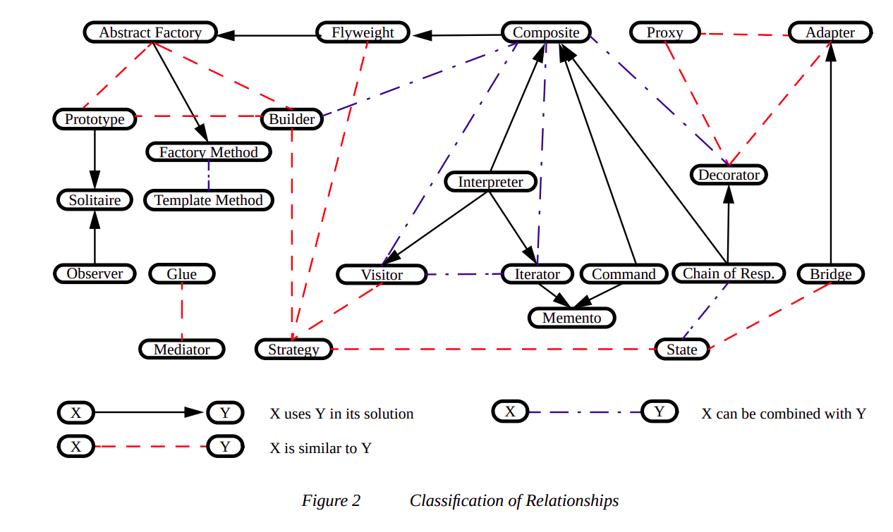
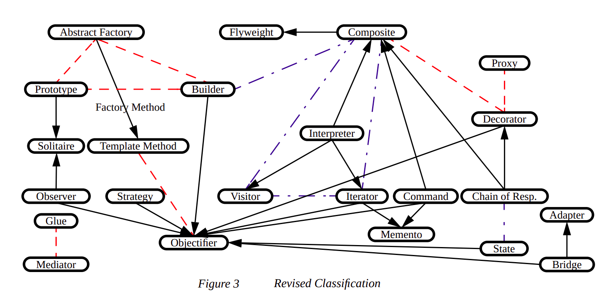
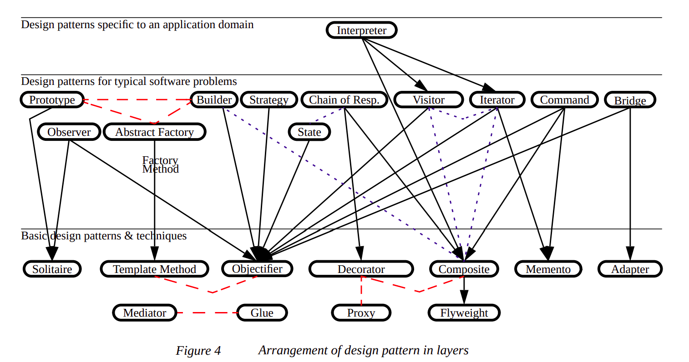

# Design Pattern
### Creational Patterns
Cung Cấp một giải pháp để tạo ra các object và che giấu được logic của việc tạo ra nó,
thay vì tạo ra object bằng cách sử dụng từ khóa new. Điều này giúp cho chương trình
trở lên mềm dẻo hơn trong việc quyết định object nào cần được tạo ra trong tình huống
được đưa ra.
- Factory method: Định nghĩa interface để sinh ra đối tượng, nhưng để cho lớp con quyết định
lớp nào được dùng để sinh ra đối tượng Factory Method, cho phép một lớp chuyến quá trình khởi
tạo cho lớp con.
- Abstract Factory: Cung cấp 1 interface cho việc tạo lập các đối tượng (có liên hệ với nhau)
mà không cần quy định lớp khi xác định lớp cụ thể tạo mỗi đối tượng.
- Builder: Tách rời việc xây dựng một đối tượng phức tạp khỏi biểu diễn của nó, sao cho
cùng một tiến trình xây dựng có thể tạo được các biểu diễn khác nhau.
- Prototype: Quy định loại của đối tượng cần tạo bằng cách dùng một đối tượng mẫu,
đối tượng mới được tạo ra nhờ vào sao chép đối tượng mẫu này.
- Singleton: Đảm bảo 1 class chỉ có 1 instance, và cung cấp một điểm truy cập toàn cục đến nó.
### Structural Patterns
Liên quan tới class và các thành phần của object. Nó dùng để thiết lập định nghĩa
quan hệ giữa các đối tượng.
- Adapter: Do vấn đề tương thích, thay đổi interface của một đối tượng thành một interface khác
phù hợp với yêu cầu của người sử dụng.
- Bridge: Tách ròi ngữ nghĩa của một vấn đề khỏi việc cài đặt, mục đích để cả 2 bộ phận
(ngữ nghĩa và cài đặt) có thể thay đổi độc lập nhau.
- Composite: Tổ chức các đối tượng theo cấu trúc phân cấp dạng cây, Tất các các đối tượng
trong cấu trúc được thao tác theo một cách thuần nhất như nhau. Tạo quan hệ thứ bậc bao gộp
giữa các đối tượng, client có thể xem đối tượng bao gộp và bị bao gộp như nhau -> khả năng
tổng quát hóa trong code của client dễ phát triển nâng cấp bảo trì.
- Decorator: Gán thêm trách nhiệm cho đối tượng vào lúc chạy.
- Facade: Cung cấp 1 interface thuần nhất cho một loạt các interface trong hệ thống con.
Nó định nghĩa 1 interface cao hơn các interface có sẵn để làm cho hệ thống con dễ sử dụng hơn.
- Flyweight: Sử dụng việc chia sẻ để thao tác hiệu quả trên một số đối tượng cỡ nhỏ.
- Proxy: Cung cấp đối tượng đại diện cho một đối tượng khác để hỗ trợ hoặc kiểm soát quá trình
truy suất đối tượng đó. Đối tượng thay thế gọi là proxy.
### Behavioral Patterns
Dùng trong việc thực hiện hành vi của đối tượng, sự giao tiếp giữa các đối tượng với nhau.
- Interpreter
- Template method
- Chain of responsibility
- Command
- Iterator
- Mediator
- Memento
- Observer
- State
- Strategy
- Visitor
#
- The overall structure of the design pattern catalogue

- Classification of Relationships

- Revised Classification

- Arrangement of design pattern in layers

