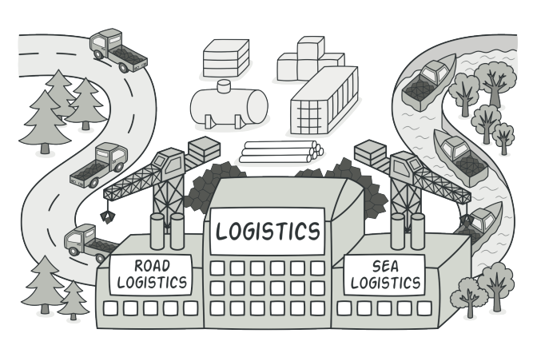
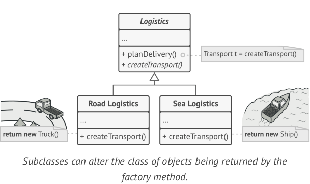
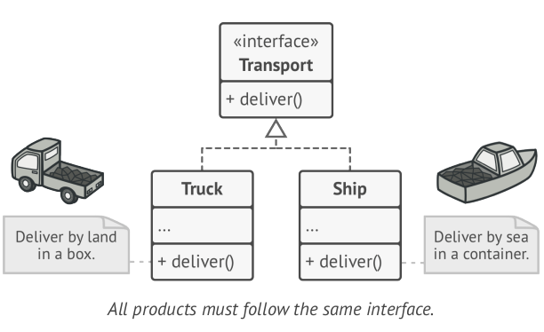

# Factory Method

### Intent
- Cung cấp 1 interface dùng cho việc tạo các đối tượng trong superclass, nhưng cho phép các subclass thay đổi kiểu của các
đối tượng mà sẽ được tạo.
### Problem
- Hãy tưởng tượng rằng chúng ta tạo một ứng dụng quản lý logistic, ở phiên bản đầu tiên ứng dụng chỉ xử lý việc vận chuyển bằng xe tải,
vì vậy phần lớn code nằm ở class Truck. Khi ứng dụng trở nên phổ biến, mỗi ngày chúng ta nhận được hàng tá các request từ các cty vận tải biển 
để kết hợp vận tải biển vào app. Đó là một tin tốt tuy nhiên về code thì sao. Hiện tại phần lớn code bị gắn chặt chẽ vào lớp Truck.
Thêm mới lớp Ship vào ứng dụng yêu cầu phải thay đổi toàn bộ codebase. Hơn thể nữa, nếu sau này muốn thêm một loại hình vận tải mới vào trong app
thì chúng ta có lẽ sẽ phải làm lại những sự thay đổi này một lần nữa. Kết quả là, chúng ta sẽ nhận được những đoạn code khó chịu,
với các điều kiện chuyển đổi hành vi của ứng dụng tùy thuộc vào loại đối tượng vận chuyển.
### Solution
- Factory Method pattern đề xuât thay thế việc khởi tạo đối tượng trực tiếp sử dụng từ khóa new bằng cách gọi một hàm factory đặc biệt.
Đối tượng vẫn sẽ vẫn được tạo ra bằng từ khóa new nhưng nó được gọi trong phạm vị của hàm factory các đối tượng được trả về từ hàm factory 
được xem như là các "sản phẩm".

- Thoạt nhhìn sự thay đổi này có vẻ vô nghĩa.chúng ta chỉ di chuyển lời gọi constrcutor ở một chỗ khác thôi.Tuy nhiên hay xem xét điều này:
Bây giờ chúng ta có thể override hàm factory trong các class con và thay đổi class của các sản phẩm được tạo bởi hàm factory. Tuy nhiên có một
hạn chế nhỏ: lóp con có thể trả về các loại sản phẩm khác nhau chỉ khi các sản phẩm này có một lớp cơ sở hoặc interface chung. Hàm factory 
trong lớp cơ sở nên có kiểu trả về giống như interface.
